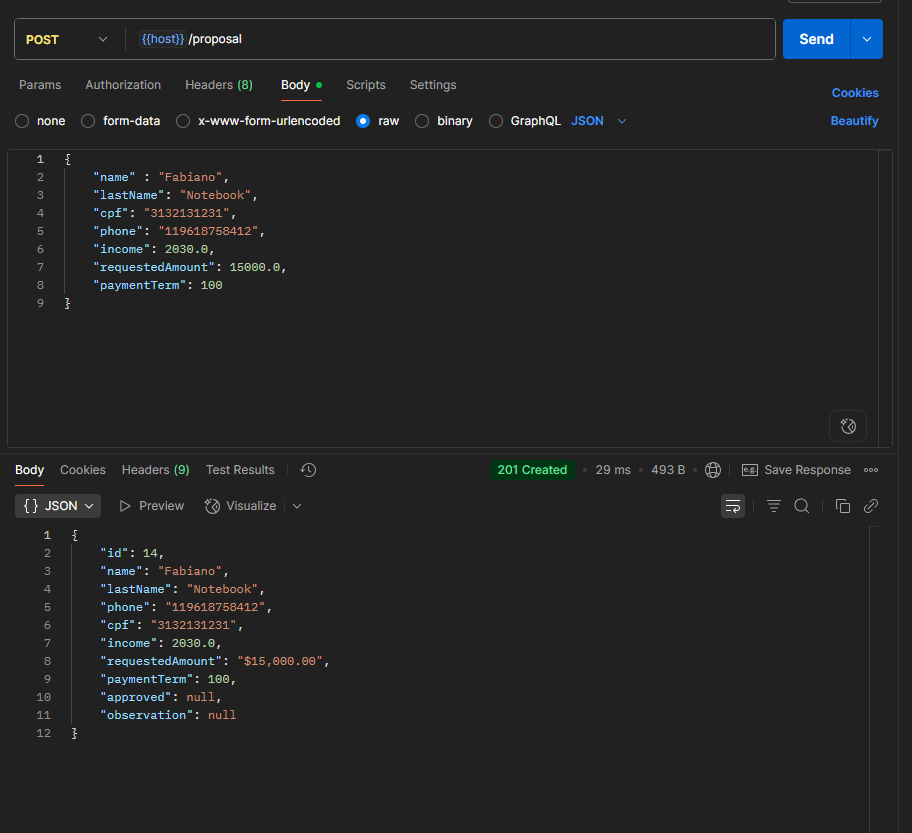
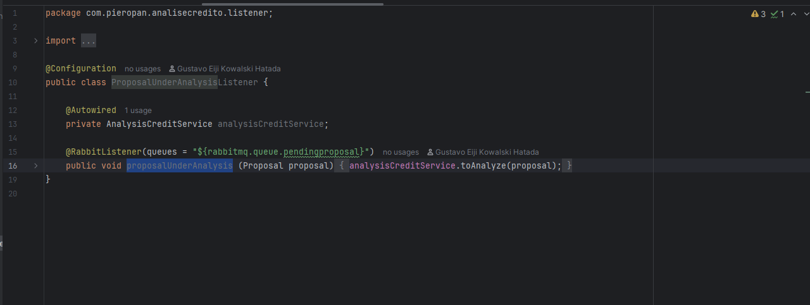
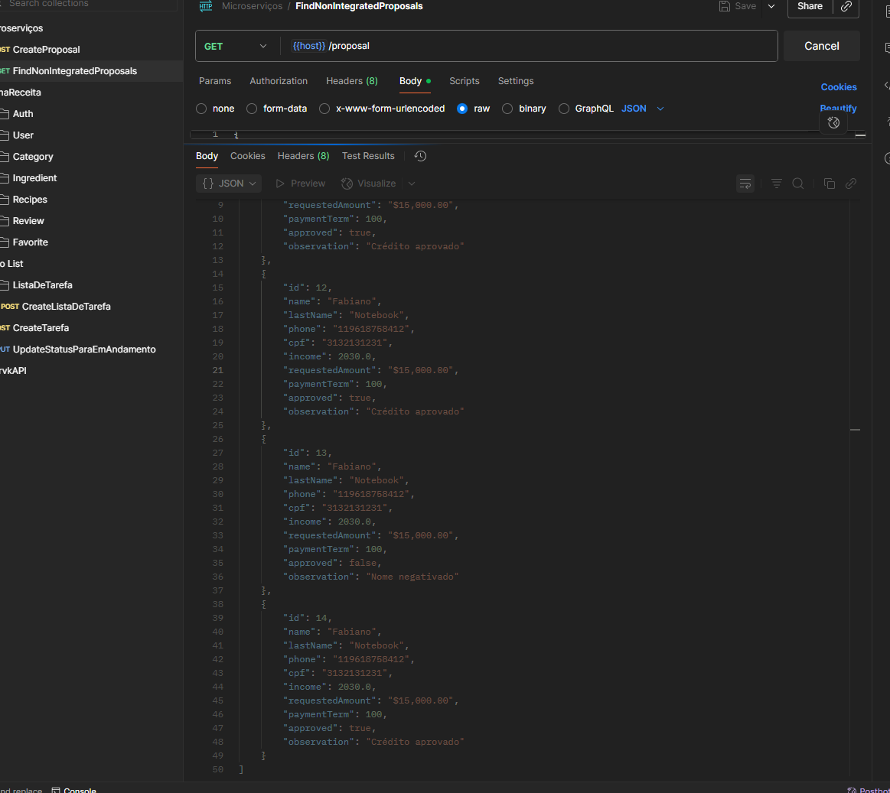

# CreditCheck- Microsserviços com RabbitMQ


<p align="center">
  
  
  
  
  
</p>

---

## 🚀 Sobre o Projeto
Este projeto foi desenvolvido para treinar **arquitetura de microsserviços** com comunicação assíncrona via **RabbitMQ**.  
## 🔄 Fluxo da Aplicação
1. O **Serviço de Propostas** faz uma solicitação de crédito, contendo os dados do cliente.



2. A mensagem é enviada para a fila de propostas pendentes e serão consumidas pelo **Serviço de Análise de Crédito**.  

3. O serviço de análise recebe, processa e retorna o resultado (aprovado/negado) para uma fila.  

4. As propostas vão para a fila de propostas completas, onde resultado é consumido pelo **Serviço de Propostas** e persistido no **banco de dados**.

5. Depois as propostas estão disponíveis para visualização contendo o resultado aprovado/reprovado com justificação.

---

## 🔄 Arquitetura do Sistema
```mermaid
flowchart LR
    A[Serviço de Propostas] -->|Exchange Proposta Pendente| B((Fila Propostas Pendentes))
    B --> C[Serviço de Análise]
    C -->|Exchange Proposta Completa| D((Fila Propostas Completas))
    D --> A
    A --> E[(Banco de Dados)]
```

## 📡 Endpoints Disponíveis

| Método | Endpoint     | Descrição                       |
|--------|--------------|---------------------------------|
| POST   | `/propostas` | Cria uma nova proposta de crédito |
| GET    | `/propostas` | Lista todas as propostas cadastradas |


## 📌 Decisões Técnicas

- **Microsserviços vs Monólito** → Escolhi microsserviços para praticar escalabilidade e baixo acoplamento.  
- **RabbitMQ vs REST síncrono** → Optei por mensageria para explorar comunicação assíncrona.  
- **Design Pattern Strategy** → Aplicado no cálculo de score para padronizar as regras de negócio.  
- **Docker** → Orquestrar banco de dados e mensageria localmente.  

---

## ✅ O que Aprendi

- Arquitetura desacoplada na prática.  
- Mensageria (Exchanges, Filas, Consumers, Producers).  
- Resiliência em sistemas distribuídos (bindings e configs via código).  
- Aplicação de padrões de projeto em cenários reais.  
- Integração de microsserviços com cloud.  

---

## 📝 Se esse projeto fosse uma vaga ?

**Descrição da vaga (simulação):**  
> Procuramos um Desenvolvedor Backend Júnior para atuar em sistemas distribuídos utilizando **Java, Spring Boot e RabbitMQ**. O candidato deve compreender arquitetura de microsserviços, mensageria e boas práticas de código limpo.

**Minha candidatura:**  
Neste projeto implementei um **analisador de crédito desacoplado em microsserviços**, com comunicação assíncrona via RabbitMQ.  
Utilizei o **Design Pattern Strategy** para regras de score, configurei **bindings e exchanges via código** e integrei com **AWS SNS**.  
O sistema foi containerizado com **Docker** e persistido em **PostgreSQL**.  

---

## ⚙️ Testando a aplicação

Estas instruções vão te ajudar a rodar o projeto localmente usando **Docker** e **Maven**.

### 📋 Pré-requisitos
<p align="left">
  <a href="https://www.docker.com/">
    
  </a>
  <a href="https://www.postman.com/">
    
  </a>
</p>

 **Clone o repositório**

```bash
https://github.com/gustavokowallski/CreditCheckAPI.git
cd CreditCheckAPI
docker compose up -d --build

```

## 🧪 Testando a API


### 1️⃣ Via Postman Collection
[](https://nawszera.postman.co/workspace/nawszera's-Workspace~ea6779bc-203d-4c77-8395-e87a3f1091fa/request/45108000-ac49d0f5-af68-43ff-bdeb-6e6618b4cc11?action=share&creator=45108000&ctx=documentation&active-environment=45108000-ee357952-f911-405a-9337-066beac8e080)


## 📂 Conheça mais sobre cada serviço:

- [Serviço de Propostas](https://github.com/gustavokowallski/Proposta-app-)  
- [Serviço de Análise de Crédito](https://github.com/gustavokowallski/Analise-credito-app)  

```bash
Esse repositório tem poucos commits pois os serviços foram feitos em repositórios separados, nesse aqui eu apenas juntei os dois para facilidade no teste da API.

```
---

🔥 Esse projeto marcou meu primeiro contato real com **microsserviços**.  
O próximo passo será construir uma solução **100% do zero, mais robusta e escalável**.

## 📜 Licença
Este projeto está sob a licença MIT. Veja o arquivo [LICENSE](LICENSE) para mais detalhes.

